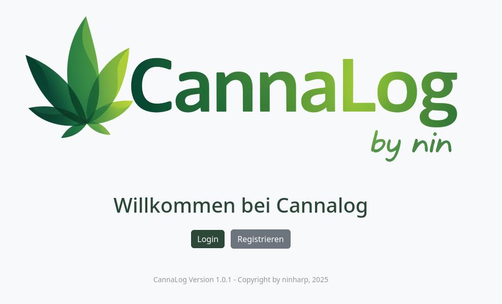
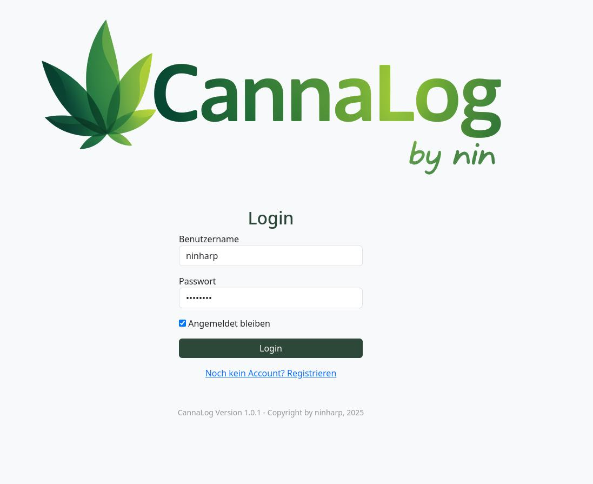
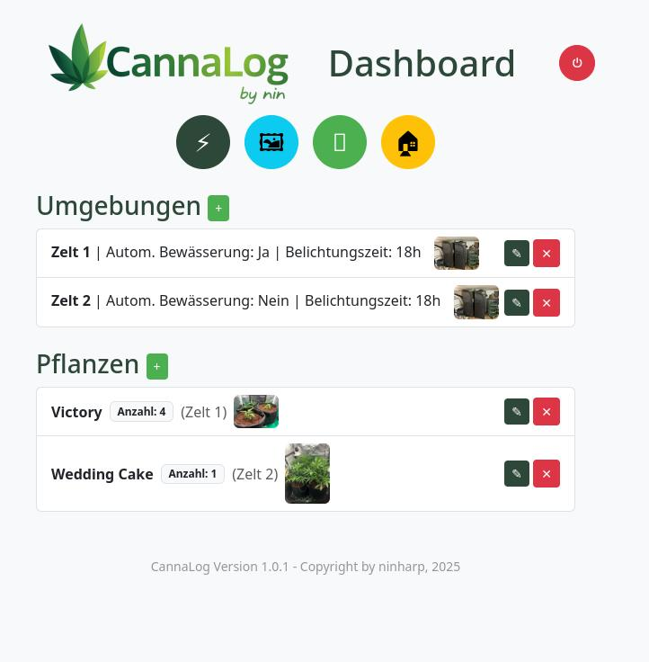
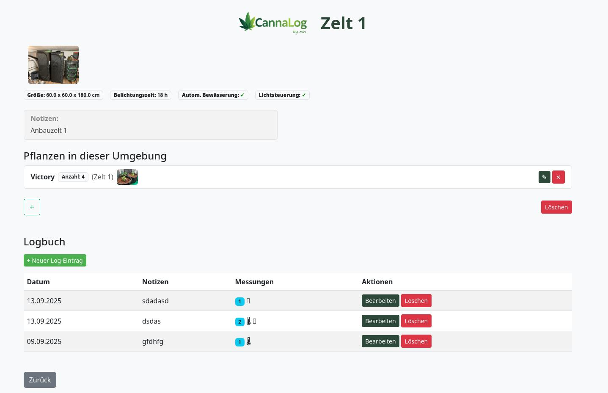
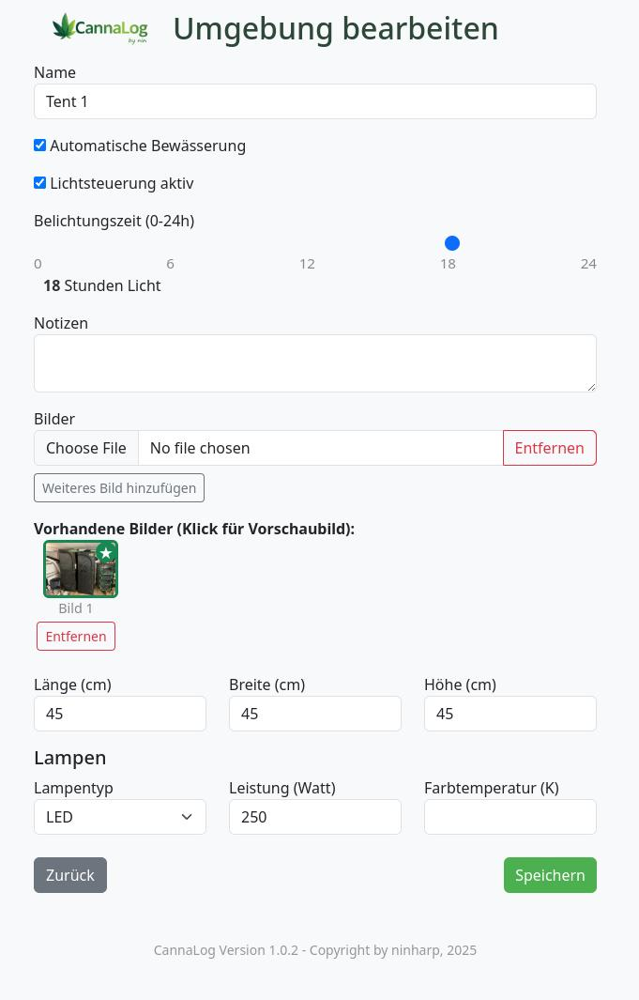
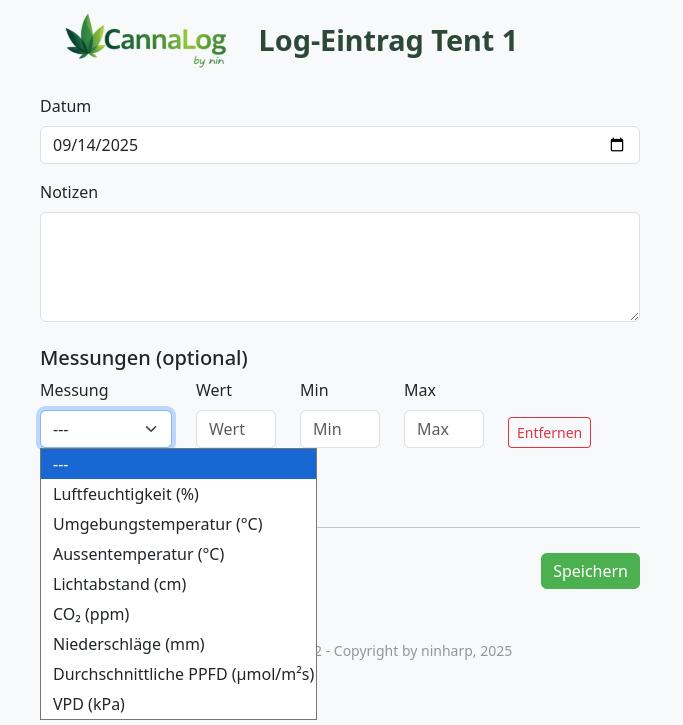
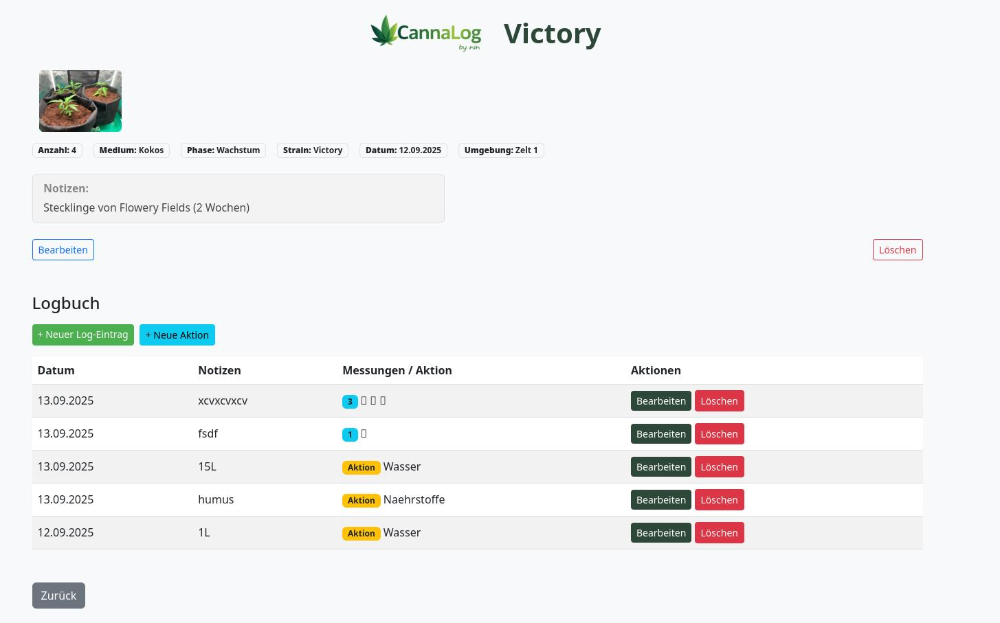
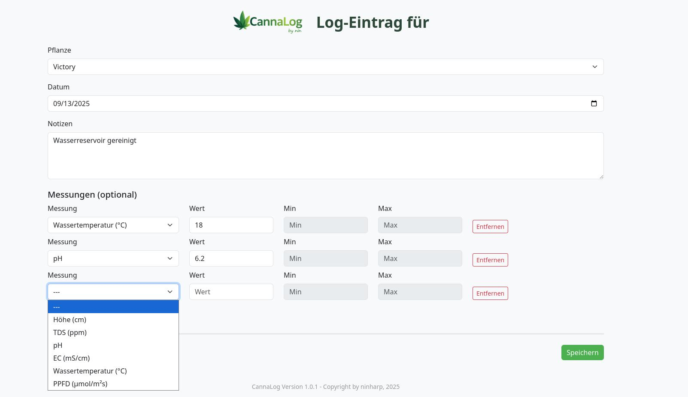
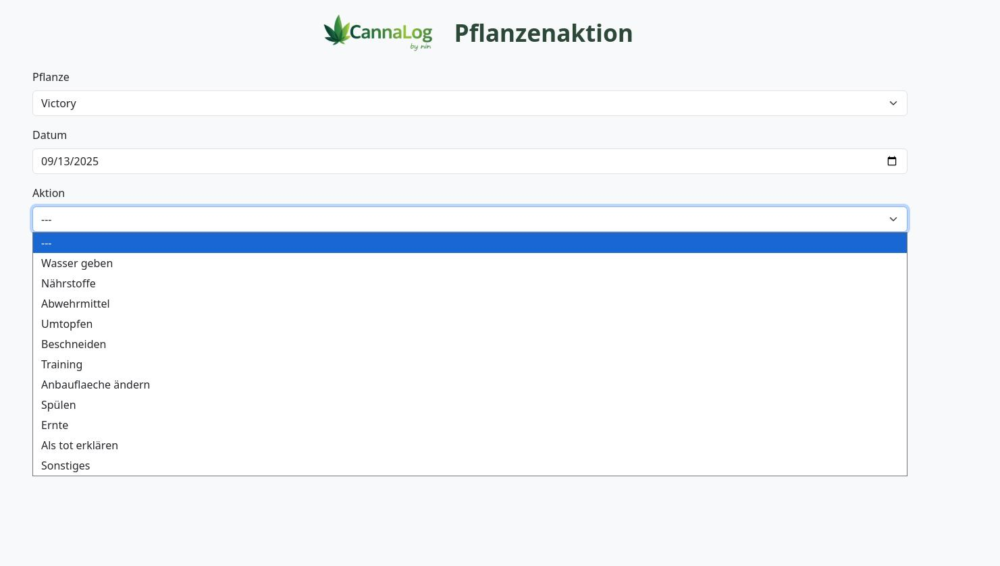
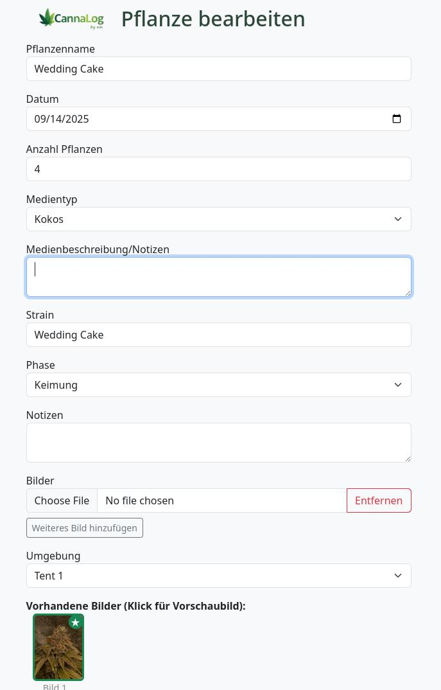

# Cannalog

CannaLog ist eine moderne, private Web-App zur Verwaltung von Pflanzen, Umgebungen, Messwerten, Aktionen und Bildern – optimiert für Desktop und Smartphone. Die Anwendung basiert auf Flask, SQLAlchemy und Bootstrap und bietet ein intuitives, responsives Dashboard für Grow- und Pflanzenprojekte.

## Features
- Pflanzen- und Umgebungsverwaltung mit Bildern und Notizen
- Logbuch für Messwerte (z.B. Temperatur, Feuchtigkeit, pH, EC, Licht, etc.)
- Aktionen-Log für Pflanzen (z.B. Gießen, Düngen, Umtopfen)
- Bild-Upload für Pflanzen und Umgebungen
- Auswahl von Vorschaubildern
- Responsive UI für Desktop und Mobile
- Zwei-Schritt-Bestätigung beim Löschen von Umgebungen mit Pflanzen
- Übersichtliche Dashboards und Detailansichten

## Screenshots

### Hauptansicht


### Login


### Dashboard


### Umgebungsübersicht


### Umgebungen editieren/hinzufügen


### Umgebungs-Logbuch


### Pflanzenübersicht


### Pflanzen-Logbuch


### Pflanzen-Aktion


### Pflanzen editieren/hinzufügen



## Installation

### Home Assistant

CannaLog gibt es als Home-Assistant-App mit Seitenleiste (Ingress) und direktem Port:
[ninharp/CannaLog_HomeAssistant](https://github.com/ninharp/CannaLog_HomeAssistant)

### Docker

```bash
docker compose up -d
```

Die App läuft dann auf http://localhost:5000, Datenbank, Bilder und der erzeugte
Sitzungsschlüssel liegen in `./data`.

| Variable | Standard | Bedeutung |
| --- | --- | --- |
| `SECRET_KEY` | leer | Leer: wird einmalig erzeugt und in `/data/secret_key` gespeichert |
| `ALLOW_REGISTRATION` | `true` | Neue Konten erlauben |
| `SECURE_COOKIES` | `false` | Cookies nur über HTTPS senden (hinter einem HTTPS-Proxy einschalten) |
| `MAX_UPLOAD_MB` | `20` | Maximale Upload-Größe |
| `CANNALOG_DATA_DIR` | `instance/` bzw. `/data` | Ablage für Datenbank, Uploads und Schlüssel |

### Lokal entwickeln

```bash
python3 -m venv .venv
.venv/bin/pip install -r requirements.txt
.venv/bin/python init_db.py
.venv/bin/python run.py
```

Für den PDF-Export braucht WeasyPrint Pango (`brew install pango` bzw. `apk add pango`).

## Releases

Ein Tag `vX.Y.Z` baut per GitHub Actions `ghcr.io/ninharp/cannalog` (Standalone) und
`ghcr.io/ninharp/{aarch64,amd64}-cannalog-addon` (Home Assistant). Danach im
HA-Repository `version` in `cannalog/config.yaml` anheben.

## Lizenz
MIT License

---

Viel Spaß beim Dokumentieren und Verwalten deiner Pflanzen!
