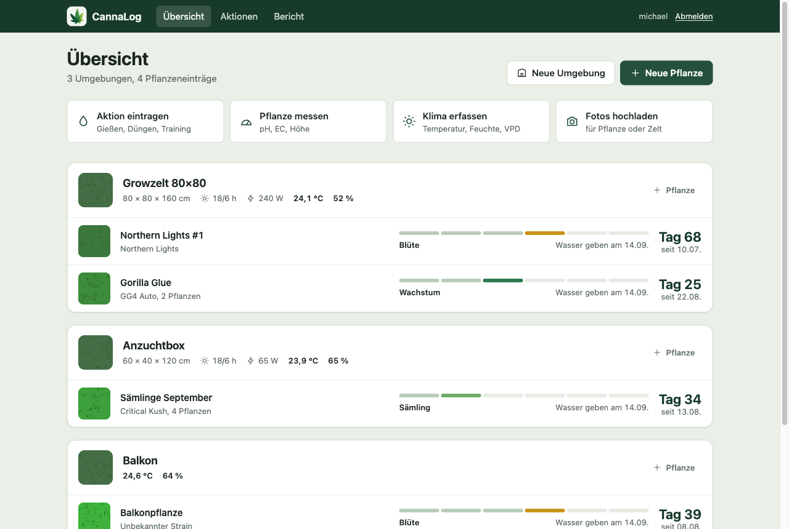
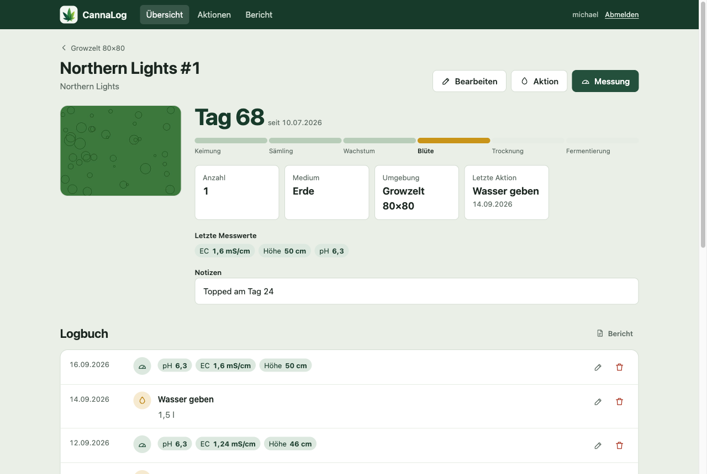
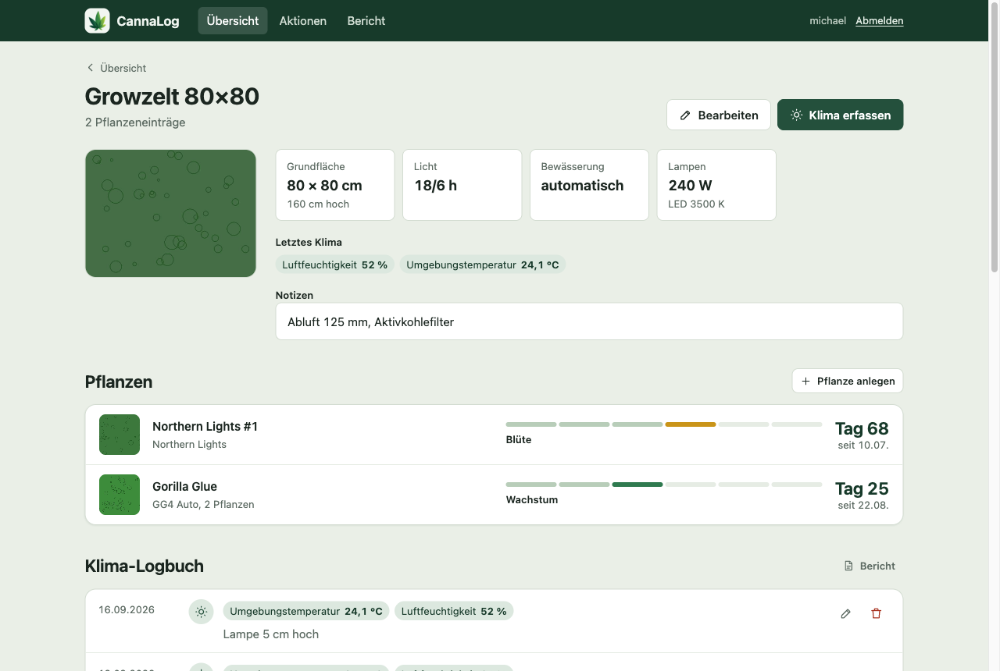
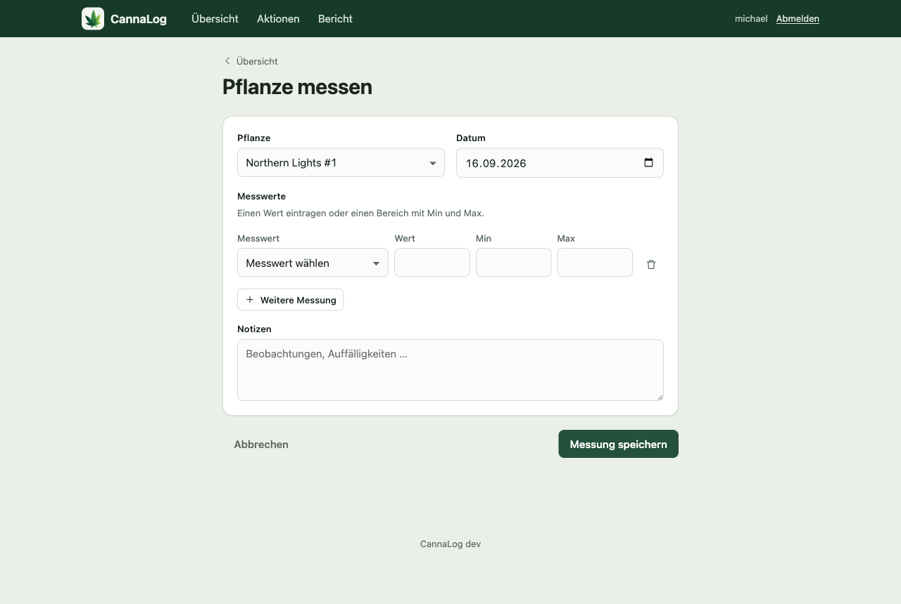
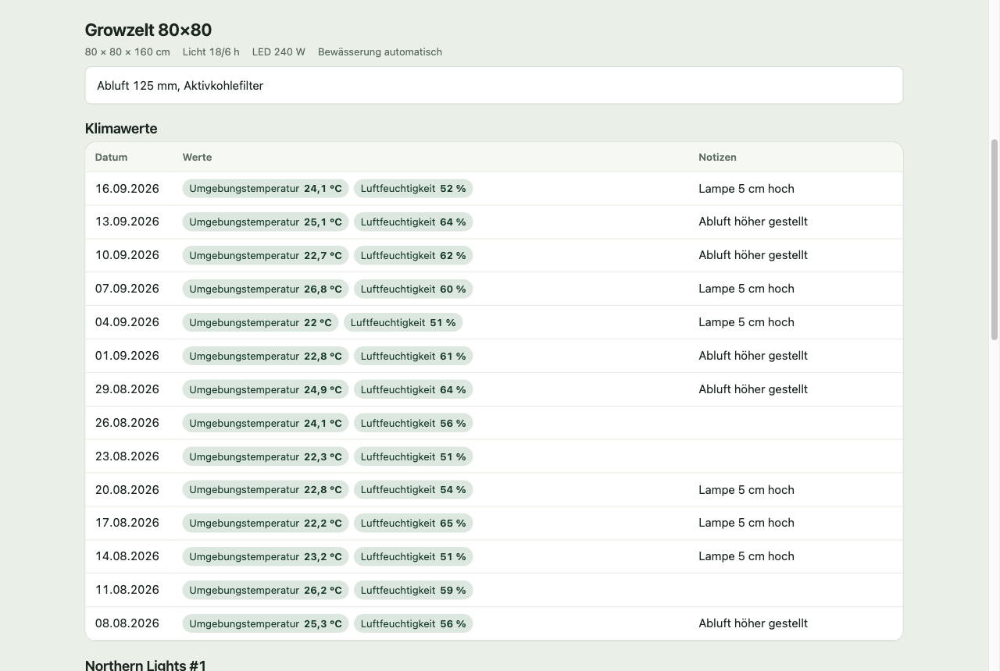
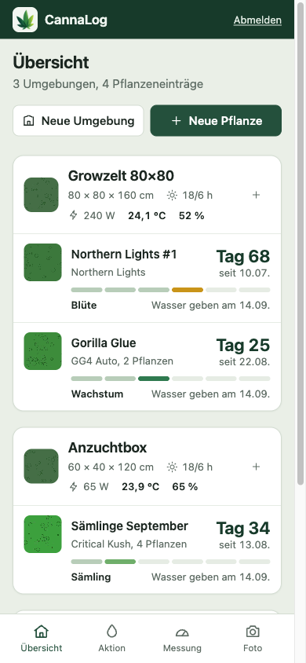
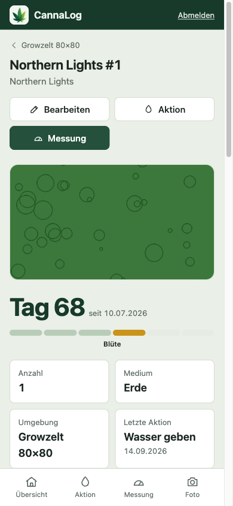
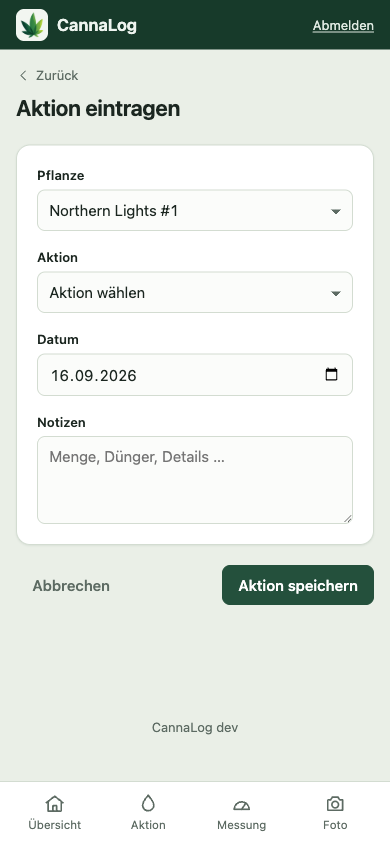

<p align="center"></p>

# CannaLog

CannaLog ist ein privates Grow-Tagebuch für Pflanzen, Zelte und Außenbereiche. Du hältst fest,
was du gießt, düngst und misst, siehst auf einen Blick, in welcher Phase jede Pflanze steht,
und stellst die Einträge als Bericht oder PDF zusammen. Die App läuft eigenständig per Docker
oder als App in Home Assistant und ist fürs Handy im Zelt genauso gebaut wie für den Desktop.



## Funktionen

- **Übersicht nach Umgebung:** jede Pflanze mit Phasenleiste, Tag seit dem Start und letzter Aktion,
  jedes Zelt mit Maßen, Lichtzyklus, Lampenleistung und dem letzten Klima
- **Aktionen:** Gießen, Düngen, Training, Umtopfen, Ernte und mehr, mit Notizen
- **Messungen:** pH, EC, TDS, Höhe, Wassertemperatur und PPFD pro Pflanze, Temperatur, Luftfeuchte,
  VPD, CO₂ und Lichtabstand pro Umgebung, jeweils als Einzelwert oder Bereich
- **Fotos:** mehrere pro Pflanze oder Umgebung, eines davon als Vorschaubild
- **Bericht:** Klima, Messungen und Aktionen einer Umgebung am Bildschirm oder als PDF
- **Schnellerfassung am Handy:** feste Leiste für Aktion, Messung und Foto
- **Mehrere Konten**, Registrierung abschaltbar

## Screenshots

| Pflanze | Umgebung |
| --- | --- |
|  |  |
| **Messung erfassen** | **Bericht** |
|  |  |

Am Handy:

<p>
  
  
  
</p>

## Installation

### Home Assistant

CannaLog gibt es als Home-Assistant-App mit Seitenleiste (Ingress) und direktem Port:
[ninharp/CannaLog_HomeAssistant](https://github.com/ninharp/CannaLog_HomeAssistant)

### Docker

```bash
docker compose up -d
```

Die App läuft dann auf http://localhost:5000, Datenbank, Bilder und der erzeugte
Sitzungsschlüssel liegen in `./data`.

| Variable | Standard | Bedeutung |
| --- | --- | --- |
| `SECRET_KEY` | leer | Leer: wird einmalig erzeugt und in `/data/secret_key` gespeichert |
| `ALLOW_REGISTRATION` | `true` | Neue Konten erlauben |
| `SECURE_COOKIES` | `false` | Cookies nur über HTTPS senden (hinter einem HTTPS-Proxy einschalten) |
| `MAX_UPLOAD_MB` | `20` | Maximale Upload-Größe |
| `CANNALOG_DATA_DIR` | `instance/` bzw. `/data` | Ablage für Datenbank, Uploads und Schlüssel |

### Lokal entwickeln

```bash
python3 -m venv .venv
.venv/bin/pip install -r requirements.txt
.venv/bin/python init_db.py
.venv/bin/python run.py
```

Für den PDF-Export braucht WeasyPrint Pango (`brew install pango` bzw. `apk add pango`).

Tests:

```bash
.venv/bin/pip install pytest
.venv/bin/python -m pytest
```

## API

CannaLog hat eine kleine JSON-API, mit der Home Assistant, ein Bedienpanel oder ein Skript
Aktionen, Messungen und Klimawerte eintragen können. Sie liegt unter `/api/v1` und ist über den
direkten Port erreichbar (nicht über Home Assistant Ingress).

**Token erzeugen:** Melde dich an, öffne die Seite „API“ und erzeuge ein Token. Es wird nur einmal
angezeigt, speichere es also gleich. Ein neues Token ersetzt das alte, auf der Seite lässt es sich auch widerrufen. Das Token gehört zu deinem
Konto, die API sieht und ändert nur deine eigenen Pflanzen und Umgebungen. Es wird bei jeder Anfrage
im Header mitgeschickt:

```
Authorization: Bearer cl_...
```

Alle Beispiele gehen von `http://localhost:5000` und einem Token in `$TOKEN` aus:

```bash
export TOKEN=cl_...
```

Bei `POST` sendest du JSON mit `Content-Type: application/json`. Diese Felder gelten für alle drei
Eintragsarten:

| Feld | Bedeutung |
| --- | --- |
| `date` | Datum als `JJJJ-MM-TT`, ohne Angabe heute |
| `time` | Uhrzeit als `HH:MM`, optional |
| `notes` | Notiz als Text, optional |

Die Uhrzeit ist bei allen Einträgen optional. Sie steht in Listen und im Bericht hinter dem Datum. Sekunden (`HH:MM:SS`) werden akzeptiert, aber verworfen. Sende `date` besser immer mit, denn ohne Angabe gilt „heute“ nach der Zeitzone des Servers.

### Status

```bash
curl -H "Authorization: Bearer $TOKEN" http://localhost:5000/api/v1/status
```

Antwort: `{"version": "1.3.0", "user": "michael"}`. Praktisch, um das Token zu prüfen.

### Umgebungen und Pflanzen

```bash
curl -H "Authorization: Bearer $TOKEN" http://localhost:5000/api/v1/environments
```

Liefert eine Liste deiner Umgebungen mit Pflanzen und den jeweils neuesten pH- und EC-Werten
(`null`, solange es keinen gibt). Hier findest du die IDs für die folgenden Aufrufe:

```json
[{"id": 1, "name": "Zelt 1",
  "plants": [{"id": 3, "name": "Gelato", "phase": "Wachstum"}],
  "latest": {"ph": {"value": 6.0, "date": "2026-10-01", "time": "08:30"},
             "ec": null}}]
```

Mit dem optionalen Parameter `recent` (ganze Zahl 0 bis 50, Vorgabe 0) trägt jede Umgebung
zusätzlich `recent`: die letzten Einträge der eigenen Pflanzen dieser Umgebung, neueste zuerst,
höchstens `recent` Stück. Ohne den Parameter bleibt die Antwort unverändert; ein ungültiger Wert
ergibt 422.

```bash
curl -H "Authorization: Bearer $TOKEN" "http://localhost:5000/api/v1/environments?recent=10"
```

```json
"recent": [
  {"type": "action", "date": "2026-10-01", "time": "18:09", "action": "wasser",
   "label": "Wasser geben", "plants": ["Gelato"], "all": true, "notes": "automatisch"},
  {"type": "measurement", "date": "2026-10-01", "time": null,
   "values": {"ph": 6.5, "ec": 1.5}, "plants": ["Gelato"], "all": true, "notes": null}
]
```

Quellen sind Aktionen und Pflanzenmessungen. Gleiche Einträge mehrerer Pflanzen (gleiche Art,
Datum, Uhrzeit, Aktion bzw. Messwerte und Notiz) erscheinen als ein Element; `all` ist wahr, wenn
es alle Pflanzen der Umgebung umfasst. Die Reihenfolge ist wie überall: Datum absteigend, Einträge
ohne Uhrzeit nach denen mit Uhrzeit desselben Tages, dann Uhrzeit absteigend. `time` und `notes`
sind `null`, wenn nicht vorhanden.

### Aktion eintragen

```bash
curl -X POST http://localhost:5000/api/v1/actions \
  -H "Authorization: Bearer $TOKEN" -H "Content-Type: application/json" \
  -d '{"plant_id": 3, "action": "wasser", "time": "08:30", "notes": "0,5 l"}'
```

`action` ist einer von `wasser`, `naehrstoffe`, `abwehrmittel`, `umtopfen`, `beschneiden`,
`training`, `anbauflaeche`, `spuelen`, `ernte`, `tot`, `sonstiges`.

### Messung an Pflanzen eintragen

```bash
curl -X POST http://localhost:5000/api/v1/measurements \
  -H "Authorization: Bearer $TOKEN" -H "Content-Type: application/json" \
  -d '{"environment_id": 1, "values": {"ph": 6.1, "ec": 1.4}}'
```

`values` ordnet jedem Messwert eine Zahl zu. Erlaubt sind `hoehe`, `tds`, `ph`, `ec`,
`wassertemperatur` und `ppfd`.

### Klimawerte einer Umgebung eintragen

```bash
curl -X POST http://localhost:5000/api/v1/environment-logs \
  -H "Authorization: Bearer $TOKEN" -H "Content-Type: application/json" \
  -d '{"environment_id": 1, "time": "14:00",
       "values": {"luftfeuchtigkeit": 62, "umgebungstemperatur": {"value": 24, "min": 22, "max": 26}}}'
```

Jeder Wert ist eine Zahl oder ein Objekt mit `value`, `min` und `max` (alle optional, mindestens eins).
Erlaubt sind `luftfeuchtigkeit`, `umgebungstemperatur`, `aussentemperatur`, `lichtabstand`, `co2`,
`niederschlaege`, `durchschnittliche_ppfd` und `vpd`. Die ID der Umgebung steht immer in
`environment_id`.

### Pflanze oder Umgebung

Bei Aktionen und Messungen gibst du genau eines von `plant_id` und `environment_id` an. Mit
`environment_id` wird der Eintrag bei jeder Pflanze der Umgebung angelegt. IDs dürfen Zahlen oder
Ziffern in Anführungszeichen sein.

### Antworten und Fehler

Erfolgreiche `POST`-Aufrufe antworten mit `201`: `{"created": 2, "plants": ["Gelato", "Zkittlez"]}`
bei Aktionen und Messungen, `{"created": 1}` bei Klimawerten. Fehler kommen als
`{"error": "…"}` mit diesen Codes:

| Code | Bedeutung |
| --- | --- |
| `401` | Token fehlt oder ist ungültig |
| `404` | Pflanze oder Umgebung gibt es nicht (oder sie gehört einem anderen Konto), auch unbekannte Adressen |
| `405` | Falsche Methode, z. B. `GET` auf einen `POST`-Endpunkt |
| `422` | Eingabe ungültig: Datum, Uhrzeit, unbekannte Aktion oder Messwert, keine Zahl, beides oder keins von `plant_id`/`environment_id`, Umgebung ohne Pflanzen |

## Releases

Ein Tag `vX.Y.Z` baut per GitHub Actions `ghcr.io/ninharp/cannalog` (Standalone) und
`ghcr.io/ninharp/{aarch64,amd64}-cannalog-addon` (Home Assistant). Danach im
HA-Repository `version` in `cannalog/config.yaml` anheben.

## Lizenz

MIT License
